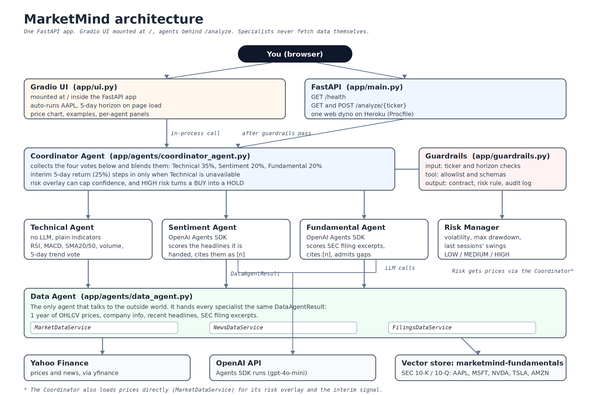

# MarketMind

MarketMind is a small multi-agent system that looks at a stock from a few different angles and then argues its way to a single recommendation: BUY, HOLD, or SELL, with a confidence score and the reasoning shown. It was built as a course project for CS529 AI Engineering at Maharishi International University. It is a demo, not financial advice, and nobody should trade on it.

**Live demo:** https://marketmind-1626769ce010.herokuapp.com/
It runs on a small Heroku dyno that sleeps when idle, so the first load can take a minute. After that it opens with an AAPL analysis already done.

## What happens when you analyze a ticker

You pick a ticker (or type any symbol) and a horizon of 5 or 10 trading days. Four agents then vote:

- The **Technical Agent** reads the price history and scores plain indicators. No LLM is involved.
- The **Sentiment Agent** gets recent headlines and has an LLM score them, citing each headline it uses.
- The **Fundamental Agent** gets excerpts from the company's SEC filings and has an LLM score those, again with citations. When the excerpts do not say something, the agent writes "not disclosed in retrieved filings" instead of guessing.
- The **Risk Manager** measures volatility, drawdown, and how jumpy the last sessions were.

The **Coordinator** blends the votes (Technical 35%, Sentiment 20%, Fundamental 20%), lets a short-term price signal step in only if the Technical Agent could not run, and applies the risk reading on top: high risk caps the confidence and turns a BUY into a HOLD. Guardrails check the input, the tool calls, and the final output, and every check is written to an audit log you can see in the UI.

If a data source is down or a key is missing, the affected agent reports `unavailable` with the reason, and the Coordinator reweights what is left instead of failing the whole run.

## Architecture



The rule that shapes the codebase: **specialist agents never fetch data themselves.** One Data Agent talks to the outside world and hands every specialist the same `DataAgentResult` (prices, company info, headlines, filing excerpts). That keeps the agents easy to test with fixed inputs and means a data problem shows up in exactly one place. The one exception is the Coordinator, which loads prices directly for its risk overlay and the fallback signal.

The two LLM agents run on the OpenAI Agents SDK (`gpt-4o-mini`). Prices and headlines come from Yahoo Finance through yfinance; the news feed uses `yf.Search` because `Ticker.news` kept coming back empty. Filings live in an OpenAI vector store named `marketmind-fundamentals` (more on that below).

More detail, if you want it: [docs/AGENTS.md](docs/AGENTS.md) describes each agent, and [docs/ARCHITECTURE.md](docs/ARCHITECTURE.md) keeps the original design notes. This README is the one we keep current.

## The agents

| Agent | What it does | Votes |
| --- | --- | --- |
| Coordinator | Blends the specialist votes, applies the risk overlay and the guardrails | BUY / HOLD / SELL |
| Data | Fetches prices, company info, headlines, and filing excerpts for everyone else | (supplies data) |
| Technical | RSI, MACD, SMA20 vs SMA50, volume, 5-day trend | bullish / neutral / bearish |
| Sentiment | LLM scores the supplied headlines, with citations | bullish / neutral / bearish |
| Fundamental | LLM scores SEC filing excerpts, with citations | buy / hold / sell |
| Risk | Volatility, max drawdown, recent swings | low / medium / high |

Any of them can also answer `unavailable`, which the Coordinator treats as "sit this one out" rather than an error.

## Data

Any ticker with price history works for the technical and risk readings, and headlines are fetched live. Fundamental analysis needs filings in the vector store, which today holds 10-K and 10-Q documents for five companies:

**AAPL, MSFT, NVDA, TSLA, AMZN**

For any other ticker the Fundamental Agent simply reports `unavailable` and the rest of the system carries on. Filing lookups are cached for 30 minutes per ticker.

## Running it locally

You need Python 3.11 (that is what `.python-version` pins and what we develop on).

```bash
python -m venv .venv

# Windows
.venv\Scripts\activate

# macOS / Linux
source .venv/bin/activate

pip install -r requirements.txt
cp .env.example .env   # then put your keys in .env, see below
```

`.env` needs two values. Without them the app still runs, but the LLM agents report `unavailable`:

- `OPENAI_API_KEY` for the Sentiment and Fundamental agents
- `FUNDAMENTALS_VECTOR_STORE_ID` for the SEC filings store

Start everything (API plus dashboard) with:

```bash
uvicorn app.main:app --reload
```

Then:

- Dashboard: http://127.0.0.1:8000/ (it runs AAPL on open, give it a few seconds)
- Health check: http://127.0.0.1:8000/health
- API docs: http://127.0.0.1:8000/docs

If you only want the dashboard, `python -m app.ui` serves it on its own at http://127.0.0.1:7860.

The API works without the UI too:

```bash
curl http://127.0.0.1:8000/analyze/AAPL
curl -X POST "http://127.0.0.1:8000/analyze/NVDA?horizon_days=10"

# and here is an input guardrail doing its job:
curl http://127.0.0.1:8000/analyze/not-a-ticker
```

## Tests

```bash
python -m pytest
```

The suite covers the agents, the data services, the guardrails, and the UI helpers. The LLM and data agents are tested against fixed inputs, so most of the suite runs offline in a few seconds. A full run on a machine with keys set also exercises the live paths, which is slower.

## Deployment

Production is a single Heroku web dyno. The `Procfile` starts the same FastAPI app you run locally; the Gradio dashboard is mounted at `/`, so one process serves both the UI and the API. Pushes to the app's git remote deploy the `main` branch, and the two config vars from `.env` (`OPENAI_API_KEY`, `FUNDAMENTALS_VECTOR_STORE_ID`) are set as Heroku config vars.

## Project layout

```text
app/
  main.py        FastAPI app, mounts the dashboard at /
  ui.py          Gradio dashboard
  agents/        Coordinator, Data, Technical, Sentiment, Fundamental, Risk
  services/      yfinance prices and news, SEC filings vector store search
  models/        request/response schemas (AgentResult, DataAgentResult, ...)
  guardrails.py  input, tool, and output checks with an audit log
  ml/            placeholder predictor, not part of the current decision
docs/            agent notes, original architecture doc, roadmap
tests/           pytest suite
```

## Team

A three-person project. Roughly:

- **Helena Pedro**: Fundamental Agent, Sentiment Agent, Gradio dashboard
- **Nandar Zaw**: Coordinator, Risk Manager, guardrails
- **Black Hat**: Data Agent and its services, Technical Agent

## Known limits

- Fundamentals only exist for the five tickers with filings in the store.
- The news feed sometimes returns headlines that are barely about the company. The Sentiment Agent is told to ignore unrelated items, and some will still color the vote a little.
- Prices come from Yahoo's public endpoints and can be slow or briefly unavailable.
- There is no backtesting yet. Recommendations are a snapshot of current evidence, not a measured track record.
