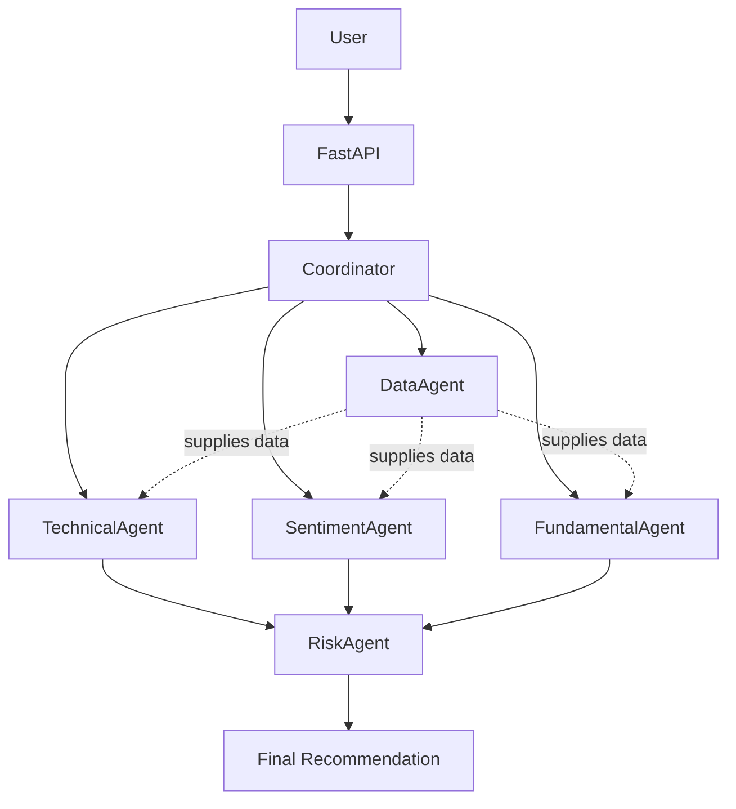

# MarketMind Architecture

MarketMind uses a simple multi-agent design that is easy to explain in class.

## High-Level Diagram (ASCII)

```text
                User
                  |
                  v
               FastAPI
                  |
                  v
           Coordinator Agent
                  |
    +-------------+-------------+
    |             |             |
    v             v             v
Technical     Sentiment    Fundamental
 Agent          Agent         Agent
    |             |             |
    +-------------+-------------+
                  |
                  v
              Risk Agent
                  |
                  v
         Final Recommendation
```

## Architecture (classroom-simple)

This Mermaid diagram shows the same flow more clearly, including how the
**DataAgent** supplies data to the analysis agents:



**How to read it:**

- Solid arrows = main control flow (User → FastAPI → Coordinator → agents → Risk → final recommendation)
- Dashed arrows labeled "supplies data" = DataAgent feeds price/company data into Technical, Sentiment, and Fundamental agents
- RiskAgent reviews the specialized agent outputs before the final recommendation

## Data Agent Role

The **Data Collector Agent** supplies information to the other agents.

Examples of data it will provide later:

- historical stock prices
- volume
- basic company information
- inputs needed by technical, sentiment, and fundamental agents

## Request Flow (Future)

1. The user sends a ticker to FastAPI (for example `AAPL`).
2. FastAPI calls the **Coordinator Agent**.
3. The Coordinator asks specialized agents for their signals.
4. The **Risk Agent** reviews risk before the final decision.
5. MarketMind returns a structured recommendation:

   - BUY / HOLD / SELL
   - confidence score
   - short explanation
   - supporting evidence from each agent

## Why This Architecture?

- Each agent has one clear job (specialization).
- The Coordinator combines results (coordination).
- Outputs are structured with Pydantic models (explainability).
- The design stays small enough for a classroom presentation.

## Phase 1 Note

Phase 1 only creates the project structure and placeholder classes.
No real analysis or agent coordination runs yet.
