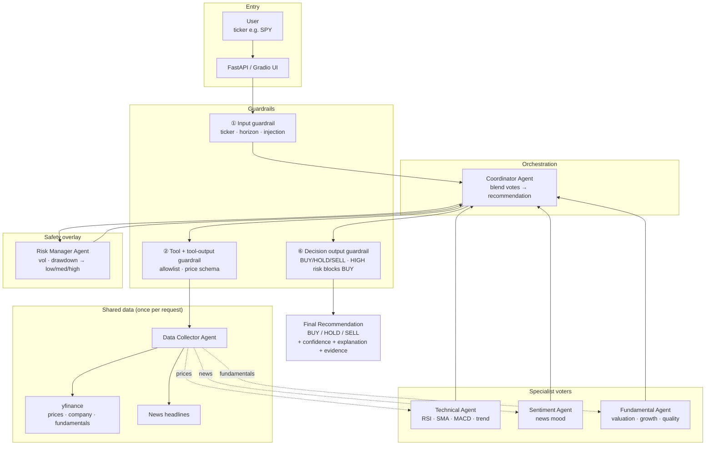

# MarketMind — Agents & Guardrails (Presentation Guide)

A classroom-friendly overview of **what each agent does**, **what guardrails are for**, and **how the system works end-to-end**.

**Focus symbol:** `SPY` (S&P 500 ETF)  
**Final output:** `BUY` / `HOLD` / `SELL` + confidence + explanation + per-agent evidence

---

## 1. Big Picture (30 seconds)

MarketMind is a **multi-agent stock analysis system**.

| Role | Who |
| --- | --- |
| Orchestrator | **Coordinator Agent** |
| Shared data source | **Data Collector Agent** |
| Specialists (voters) | Technical · Sentiment · Fundamental |
| Safety overlay | **Risk Manager Agent** |
| Safety checks | **Guardrails** (input → tool → output) |

Specialists never issue BUY/HOLD/SELL.  
Only the **Coordinator** (plus the output guardrail) produces the final recommendation.

---

## 2. Big-Picture Architecture

Use this diagram first in a presentation: it shows **who talks to whom**, where **data** flows, and where **guardrails** sit.

### 2.1 System overview (Mermaid)



**How to read it:**

| Arrow style | Meaning |
| --- | --- |
| Solid | Control flow (who calls whom) |
| Dashed | Data supply (DataAgent feeds specialists once) |
| Guardrail boxes | Checks that can **stop** the run (hard) or **rewrite** the answer (soft) |

### 2.2 Classroom ASCII (works on any slide / whiteboard)

```text
+--------------------------------------------------------------------------+
|                         MARKETMIND BIG PICTURE                           |
+--------------------------------------------------------------------------+

   User  -->  FastAPI / Gradio
                    |
                    v
            +---------------+
            | 1 INPUT       |  "Is this a real ticker, not an injection?"
            |   GUARDRAIL   |
            +-------+-------+
                    v
            +---------------+
            |  COORDINATOR  |  owns the whole run; only agent that
            |     AGENT     |  may output BUY / HOLD / SELL
            +-------+-------+
                    |
        +-----------+-----------+
        |           |           |
        v           v           v
 +------------+  (once)   +-------------------------------------+
 | 2 TOOL     |---------->|         DATA COLLECTOR AGENT        |
 | GUARDRAIL  |           |  prices · news · fundamentals       |
 +------------+           +------------------+------------------+
                                             | shared result
              +------------------------------+------------------------------+
              |                              |                              |
              v                              v                              v
     +-----------------+          +-----------------+          +-----------------+
     | TECHNICAL       |          | SENTIMENT       |          | FUNDAMENTAL     |
     | bullish/neutral |          | bullish/neutral |          | bullish/neutral |
     | /bearish        |          | /bearish        |          | /bearish        |
     +--------+--------+          +--------+--------+          +--------+--------+
              |                            |                            |
              +----------------------------+----------------------------+
                                           v
                                  +-----------------+
                                  | RISK MANAGER    |  low / medium / high
                                  | (no BUY/SELL)   |
                                  +--------+--------+
                                           v
                                  +-----------------+
                                  | Coordinator     |  weighted blend
                                  | blends votes    |
                                  +--------+--------+
                                           v
                                  +-----------------+
                                  | 6 OUTPUT        |  HIGH risk + BUY -> HOLD
                                  |   GUARDRAIL     |
                                  +--------+--------+
                                           v
                         FINAL: BUY / HOLD / SELL
                         + confidence + explanation
                         + per-agent evidence + audit log
```

### 2.3 One-sentence architecture

> **Coordinator** loads **Data** once, asks three **specialists** for independent votes, asks **Risk** for a safety level, blends the votes, then **guardrails** ensure the final answer is valid and capital-preserving.

---

## 3. Pipeline Flow (step-by-step)

```text
User (ticker, e.g. SPY)
        │
        ▼
   FastAPI / Gradio UI
        │
        ▼
  Coordinator Agent
        │
        ├─ ① Input guardrail  (is the ticker safe & valid?)
        │
        ├─ ② Tool guardrail → Data Agent (fetch once)
        │         └─ Tool-output guardrail (is price data usable?)
        │
        ├─ ③ Specialists (shared data, independent votes)
        │         Technical  → bullish / neutral / bearish
        │         Sentiment  → bullish / neutral / bearish
        │         Fundamental→ bullish / neutral / bearish
        │
        ├─ ④ Risk Agent → low / medium / high
        │
        ├─ ⑤ Weighted blend → BUY / HOLD / SELL
        │
        └─ ⑥ Decision output guardrail
                  └─ Final recommendation + audit log
```

**Key design choices:**

1. **One job per agent** — easy to explain and debug.
2. **DataAgent runs once** — prices, news, and fundamentals are shared (no triple fetch).
3. **Specialists vote independently** — Coordinator blends; Risk can override unsafe BUY.
4. **Guardrails leave an audit trail** — every check is logged for the presentation / demo UI.

---

## 4. What Each Agent Does

### 4.1 Data Collector Agent (`data_agent`)

| | |
| --- | --- |
| **Job** | Shared market-data source for the whole pipeline |
| **Does** | Pull OHLCV prices, company info, fundamental metrics, recent news |
| **Does not** | Score signals or recommend BUY/HOLD/SELL |
| **Output** | `DataAgentResult` (prices, news, fundamentals, metadata) |

**Who uses it:**

- Technical ← `price_history`
- Sentiment ← `news`
- Fundamental ← `fundamentals`
- Risk / Coordinator ← prices (via Coordinator)

Think of it as the **librarian**: gather facts; do not give opinions.

---

### 4.2 Technical Analysis Agent (`technical_agent`)

| | |
| --- | --- |
| **Job** | Price-trend evidence from charts / indicators |
| **Input** | OHLCV from DataAgent (≥ ~50 bars preferred) |
| **Tools** | RSI(14), SMA20 vs SMA50, MACD(12/26/9), 5-day trend; volume = supporting only |
| **Voting** | Each indicator votes +1 / 0 / −1 → score ≥ +2 **bullish**, ≤ −2 **bearish**, else **neutral** |
| **Output** | `bullish` / `neutral` / `bearish` + confidence + explanation |

Never outputs BUY/HOLD/SELL — only a technical vote for the Coordinator.

---

### 4.3 Sentiment Analysis Agent (`sentiment_agent`)

| | |
| --- | --- |
| **Job** | News mood around the ticker |
| **Input** | Recent headlines from DataAgent (up to ~8; needs ≥ 2) |
| **How** | With `OPENAI_API_KEY`: LLM scores grounded only on those headlines. Without key / on failure: keyword fallback |
| **Voting** | Score ≥ +0.33 **bullish**, ≤ −0.33 **bearish**, else **neutral** |
| **Unavailable** | Too little news → agent does **not** vote (pipeline continues) |

Headlines are treated as **untrusted data**, never as instructions (anti-injection).

---

### 4.4 Fundamental Analysis Agent (`fundamental_agent`)

| | |
| --- | --- |
| **Job** | Valuation / growth / quality from metrics |
| **Input** | `DataAgentResult.fundamentals` (yfinance snapshot: P/E, growth, margins, debt, ETF returns, …) |
| **How** | Classroom metric votes (valuation, growth, margins, debt, ETF YTD/3Y, etc.) |
| **Voting** | Score ≥ +2 **bullish**, ≤ −2 **bearish**, else **neutral** |
| **Unavailable** | Empty snapshot → no vote |

For the S&P 500 (`SPY`) path, fundamentals come from the **API snapshot**, not SEC file RAG.

---

### 4.5 Risk Manager Agent (`risk_agent`)

| | |
| --- | --- |
| **Job** | Safety overlay — “how dangerous is the recent path?” |
| **Input** | Price history + optional specialist signals (event pressure) |
| **Measures** | Annualized volatility, max drawdown, 5-day return / latest move |
| **Output** | `low` / `medium` / `high` + confidence + explanation |

**Critical rule:** Risk never says BUY or SELL.  
It only classifies risk so the Coordinator (and output guardrail) can protect capital.

---

### 4.6 Coordinator Agent (`coordinator_agent`)

| | |
| --- | --- |
| **Job** | Run the pipeline and produce the **only** trading recommendation |
| **Steps** | Guard input → load Data once → run specialists → run Risk → blend → guard output |
| **Horizon** | Default **5 trading days** |
| **Output** | `FinalRecommendation`: BUY/HOLD/SELL, confidence, explanation, evidence, guardrail events |

#### How the blend works

| Agent | Weight |
| --- | --- |
| Technical | 0.35 |
| Sentiment | 0.20 |
| Fundamental | 0.20 |

- `unavailable` agents do **not** vote.
- If Technical is missing, a labeled **5-day return** context can contribute (weight 0.25).
- Blended score **> +0.25** → BUY; **< −0.25** → SELL; otherwise HOLD.
- High risk can force HOLD/SELL and cap confidence.
- Soft policy: **HIGH risk + BUY → rewritten to HOLD** (output guardrail).

---

## 5. Guardrails — What Are They For?

**Guardrails** are safety rules that wrap the agent pipeline.

They answer three classroom questions:

1. **Did we accept safe user input?**
2. **Did we only call allowed tools with safe arguments?**
3. **Did we return a valid, policy-safe answer?**

Without guardrails, a bad ticker, a broken data pull, or a reckless BUY under HIGH risk could slip through.

**Location:** `app/guardrails.py`  
**Applied mainly by:** Coordinator (and FastAPI maps hard failures → HTTP 400)

---

## 6. How Guardrails Work

There are **three layers** (plus specialist schema checks):

### 6.1 Input guardrails

**When:** Before any agent runs.  
**Purpose:** Reject bad or unsafe user input.

| Check | Rule |
| --- | --- |
| Non-empty ticker | Required |
| Prompt injection / URLs | Block markers like “ignore previous”, `http://`, `<script`, … |
| Ticker format | 1–5 letters after normalization (`^GSPC` / `SPX` → `SPY`) |
| Horizon | Integer **1–21** days |

**Hard fail** → `GuardrailTripwire` → request stops.

---

### 6.2 Tool guardrails (+ tool-output)

**When:** Before / after calling market-data tools.  
**Purpose:** Only allow approved tools, safe args, and usable results.

| Check | Rule |
| --- | --- |
| Allowlist | Only `get_price_history` |
| Lookback | Days between **20** and **252** |
| Tool ticker | Valid 1–5 letter ticker |
| Tool output | Non-empty DataFrame, has `Close`, ≥ **20** rows |

**Hard fail** → stop the run (no decision on garbage data).

---

### 6.3 Output guardrails

**Specialist output** (each agent result):

- Allowed signals only (`bullish` / `neutral` / `bearish` / `unavailable`; Risk: `low` / `medium` / `high`)
- Confidence clipped to **0–1**
- Explanation required (truncated to 1200 chars)

**Decision output** (final recommendation):

| Type | Rule |
| --- | --- |
| Hard | Must be BUY / HOLD / SELL; confidence 0–1; explanation required |
| Soft | **HIGH risk cannot stay BUY** → rewrite to **HOLD**, cap confidence ≤ 0.45 |

Soft rewrites are **recorded as events** (audit trail for demos / grading).

---

### 6.4 Hard vs soft (easy talking point)

```text
Hard guardrail  →  stop the request (tripwire)
Soft guardrail  →  rewrite / adjust the answer and log why
```

Example soft policy for the slide:

> “Even if specialists lean BUY, **HIGH risk forces HOLD** — capital preservation first.”

---

## 7. How Agents Interact (one slide)

```text
Coordinator owns the run
        │
        ├── DataAgent (once) ──► shared bundle
        │
        ├── Technical / Sentiment / Fundamental
        │         (independent voters; no cross-calls)
        │
        ├── Risk (sees prices + specialist pressure)
        │
        └── Blend + output guardrail → BUY / HOLD / SELL
```

- Specialists **do not call each other**.
- Failures in specialists degrade to `unavailable` so the pipeline can still finish.
- Only Coordinator + decision guardrail set the trading label.

---

## 8. Demo Talking Points

1. **Specialization:** six clear roles; DataAgent has no opinion; Risk has no trade.
2. **Coordination:** weighted votes, not a single black-box model.
3. **Safety:** input / tool / output guardrails + HIGH-risk blocks BUY.
4. **Explainability:** every agent returns a short explanation; UI can show the guardrail log.
5. **Classroom scope:** 5-day horizon; focus on `SPY`; structured Pydantic outputs.

---

## 9. Quick Reference Card

| Agent | Question it answers | Signal type |
| --- | --- | --- |
| Data | “What facts do we have?” | Data only |
| Technical | “What do the prices say?” | bullish / neutral / bearish |
| Sentiment | “What does the news say?” | bullish / neutral / bearish |
| Fundamental | “What do the metrics say?” | bullish / neutral / bearish |
| Risk | “How dangerous is this?” | low / medium / high |
| Coordinator | “So should we BUY, HOLD, or SELL?” | BUY / HOLD / SELL |

| Guardrail layer | Protects against |
| --- | --- |
| Input | Bad tickers, injection, invalid horizon |
| Tool | Unapproved tools, unsafe lookbacks, empty/malformed prices |
| Output | Invalid schemas; reckless BUY under HIGH risk |

---

## Related docs

- `docs/AGENTS.md` — detailed per-agent I/O
- `docs/ARCHITECTURE.md` — diagrams and request flow
- `docs/DATA_AGENT.md` / `docs/TECHNICAL_AGENT.md` — deep dives
- `app/guardrails.py` — implementation
